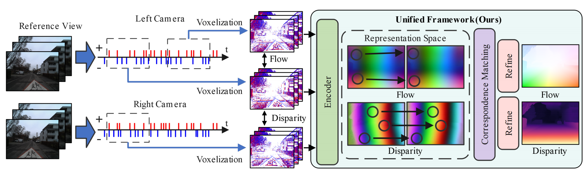

<div align="center">

## EMatch: A Unified Framework for Event-based Optical Flow and Stereo Matching

[Pengjie Zhang](), [Lin Zhu](), [Xiao Wang](), [Lizhi Wang](), [Hua Huang]()

</div>

This is the official codebase for the paper **EMatch: A Unified Framework for Event-based Optical Flow and Stereo Matching (ICCV 2025)**.

## 💥 News

- **[2025.07.03]** 🚀 We released the traning and evaluation code.

- **[2025.06.24]** 🎉 EMatch is accepted by ICCV 2025.

## 👀 Introduction

EMatch is a unified framework applicable to both optical flow and stereo matching for event cameras. We reformulate these two tasks as a pixel-wise correspondence matching problem and design a novel unified framework to solve them within a shared representation space. Within our unified framework, you can either train the single-task model for flow or disparity separately, or jointly train a multi-task model — both achieve optimal performance.

<p align="center">
     <br>
</p>

## 🛠️ Denpendency

You can install `anaconda` and configure the virtual environment.

The following is a feasible version configuration:

- python = 3.8
- pytorch = 2.0.0
- CUDA = 11.7 (NVIDIA-SMI = 515.76)
  
You can refer to the following installation steps:

1. Create and activate a virtual environment.

    ```
    conda create -n ematch python=3.8
    activate ematch
    ```

2. Install Pytorch and CUDA.

    ```
    conda install pip
    pip install torch==2.0.0 torchvision==0.15.1 torchaudio==2.0.1
    ```

    You can find the installation instructions on the [PyTorch official website](https://pytorch.org/get-started/previous-versions/).

3. Install the necessary python libraries.
   
    ```
    pip install -r requirements.txt
    ```

## 🤖️ Checkpoints

You can download all checkpoints here: [Google Drive]() / [BaiduDisk]()

## 📁 Datasets

Please download the [DSEC](https://dsec.ifi.uzh.ch/) and [MVSEC](https://daniilidis-group.github.io/mvsec/) datasets. 

Details about the datasets can be found in the [data/README.md](./data/README.md) file.


## 📈 Training and Evaluation

All training and evaluation scripts are provided in the `/scripts` directory. 

For example, you can run the `.sh` files directly from the command line to obtain results of *EMatch-unified*:

```
sh ./scripts/test/unified/dsec_ematch_flow.py
sh ./scripts/test/unified/dsec_ematch_disparity.py
sh ./scripts/test/unified/mvsec_ematch_flow.py
sh ./scripts/test/unified/mvsec_ematch_disparity.py
```

You can run the following `.sh` files to train *EMatch-unified*:

```
sh ./scripts/train/unified/dsec_ematch_stage1.sh
sh ./scripts/train/unified/dsec_ematch_stage2.sh
sh ./scripts/train/unified/mvsec_ematch.sh
```

More scripts are available in the `/scripts` directory. If you wish to conduct further experiments, you may customize the provided `.sh` files to fit your specific requirements.

## 💌 Acknowledgement

We would like to thank the following projects for their contributions to this work: [DCEI](https://github.com/danqu130/DCEIFlow), [TMA](https://github.com/tudelft/idnet), [IDNet](https://github.com/tudelft/idnet), [E-RAFT](https://github.com/autonomousvision/unimatch), [se-cff](https://github.com/autonomousvision/unimatch), [unimatch](https://github.com/autonomousvision/unimatch).
